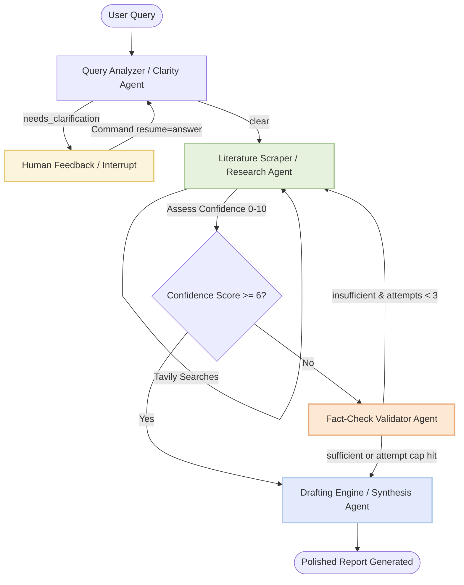

# Aetheris · Deep Research AI Assistant

A production-grade, state-persisted multi-agent research assistant designed to turn unstructured user research requests into publication-ready, factual, and highly formatted business intelligence reports. Powered by **LangGraph**, **Unify AI LLMs**, **Tavily API**, and **Streamlit**.

---

## 🏗️ Architectural Blueprint

Aetheris operates as a stateful, cyclical multi-agent graph system managed by **LangGraph**. The workflow dynamically branches, loops, and self-corrects based on real-time data evaluation and human collaboration.



---

## 🌟 Key Engineering Highlights

### 1. Epistemic Rigor & Self-Correcting Loops
Rather than trusting a single LLM generation pass, Aetheris implements an **autonomous evaluation-retry pipeline**:
* **Multi-Aspect Scraping:** The Research Agent conducts three parallel web queries (latest news, financials, and recent developments) using the Tavily API to bypass query myopia.
* **Confidence Gating:** The agent assigns an internal confidence score ($0-10$) evaluating the completeness of the retrieved findings. High-confidence runs ($\ge 6$) bypass validation, reducing latency.
* **Stateful Audit:** Low-confidence findings are redirected to the **Validator Agent**, which cross-references facts against the original query. If evaluated as `"insufficient"`, the graph loops back to the Research Agent for up to **3 attempts**, shifting queries to retrieve complementary data.

### 2. State Persistence & Contextual Memory
Leveraging LangGraph's `MemorySaver` checkpointer, the application serializes the entire state snapshot (messages, attempts, validation scores, and raw search documents) keyed by a unique `thread_id`. This yields:
* **Multi-Turn Discussions:** Aetheris inherits historical context natively across graph executions. A user can run a follow-up query (e.g., *"What about their main competitors?"*) on the same thread without losing context from the initial analysis.
* **Resilient Restoration:** If the execution fails or pauses for user input, the state remains safe in the checkpointer, avoiding expensive re-computation.

### 3. Human-in-the-Loop (HITL) Session Suspensions
Vague user inputs (e.g., *"Tell me about Apple"*) trigger a session suspension.
* **Non-Blocking Interrupts:** The Clarity Agent leverages LangGraph's `interrupt()` function to halt execution mid-run, return control to the parent thread, and prompt the user for clarification.
* **Clean State Resumption:** Once the user inputs clarification (e.g., *"I want to know about their 2024 AI product releases"*), the host application resumes execution by issuing a `Command(resume=user_answer)`. The graph replays from the interrupt node, using the new details to update the state.

### 4. API Rate-Limit Resilience
To mitigate rate-limiting issues (`HTTP 429`) common on free-tier APIs, each LLM node implements a structured exponential/static backoff retry strategy. If Gemini returns a rate-limit exception, the node pauses for $25\text{ seconds}$ before retrying the invocation, ensuring graph runs complete successfully under high traffic.

---

## 🎨 Premium Streamlit Dashboard

The web interface is styled using a custom earthy and modern parchment design system (`--sb-grad`, `--bg-grad`, and brand greens) prioritizing responsive layouts and micro-animations.

* **Agent Progress Tracker:** Live indicators displaying agent states (Idle, Busy, Complete) and specific task updates.
* **Confidence Indicators:** Color-coded status badges reflecting the current research session confidence levels.
* **Formatted Outputs:** Clean card structures with automatically extracted topic tags and citation blocks.
* **Interrupt Modals:** Prompts displaying clarification queries that pause graph execution until user input is received.

---

## 📂 Codebase Structure

```filepath
Mughees-Aetheris-deep.research/
│
├── agents/
│   ├── __init__.py
│   ├── clarity_agent.py      # Evaluates query specificity
│   ├── research_agent.py     # Parallel search & confidence scoring
│   ├── validator_agent.py    # Audits findings against query
│   └── synthesis_agent.py    # Drafts final structured report
│
├── extra.content/            # Supplemental files
│   ├── Aetheris_Deep_Research.pdf    # Sample output report PDF
│   └── Aetheris_Engineering_Epistemic_Rigor.mp4  # Interface demonstration video
│
├── .gitignore                # Standard ignore file (ignores secrets)
├── README.md                 # Project documentation
├── aetheris_logo.png         # Custom minimalist brand logo
├── app.py                    # Polished Streamlit web application
├── graph.py                  # LangGraph compiler & conditional routing
├── state.py                  # TypedDict definition of Graph State
├── test.py                   # E2E multi-turn CLI demonstration
└── requirements.txt          # Python dependencies
```

---

## ⚙️ Setup & Installation

### 1. Clone & Navigate
```bash
git clone <your-repo-url>
cd Mughees-Aetheris-deep.research
```

### 2. Configure Environment Variables
Create a `.env` file inside the root folder:
```env
OPENROUTER_API_KEY=your_unify_api_key_here
TAVILY_API_KEY=your_tavily_api_key_here
OPENROUTER_MODEL=gateway-claude-opus-4-8
OPENROUTER_BASE_URL=https://api.unify.ai/v0
```

### 3. Install Dependencies
```bash
pip install -r requirements.txt
```

### 4. Run the Streamlit UI
```bash
streamlit run app.py
```

### 5. Run the CLI Test Harness
To see the multi-turn memory and human-in-the-loop CLI interrupt loop in action:
```bash
python test.py
```

---

## 🔧 Core Tech Stack

* **Frameworks:** Python, LangGraph (StateGraph, MemorySaver), Streamlit.
* **Large Language Models:** Unify AI API (`gateway-claude-opus-4-8` model).
* **Information Retrieval:** Tavily Search API (optimized specifically for agentic workflows).
* **Styling:** CSS3 variables, HTML5 tags, and Custom-themed Streamlit layout.
