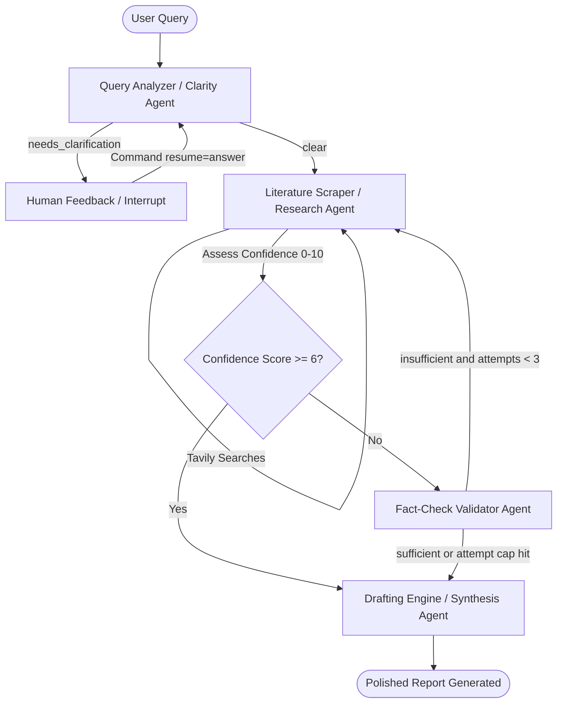

# Aetheris Deep Research AI Assistant

Aetheris is a state-persisted multi-agent research assistant that turns user research requests into structured business intelligence reports. It is powered by LangGraph, FastAPI, Tavily, and a static HTML/CSS/JavaScript interface.

## Architecture

The system runs a cyclical multi-agent graph managed by LangGraph:



## HTML UI

The browser UI lives in the project root:

- `index.html` defines the application shell.
- `style.css` contains the visual system and responsive layout.
- `script.js` handles session state, streaming updates, and calls to `/api/chat`.
- `api/index.py` serves the FastAPI backend and mounts the static UI locally.

For local development, run the FastAPI server and open the root URL. The same process serves both the HTML UI and API endpoints.

## Setup

1. Install dependencies:

```bash
pip install -r requirements.txt
```

2. Configure `.env` in the project root:

```env
UNLIMITED_API_KEY=your_unlimited_api_key_here
UNLIMITED_MODEL=claude-opus-4-8-20260501
UNLIMITED_BASE_URL=https://unlimited.surf
TAVILY_API_KEY=your_tavily_api_key_here
```

3. Run the HTML UI and API server:

```bash
uvicorn api.index:app --host 127.0.0.1 --port 8000
```

Then open:

```text
http://127.0.0.1:8000
```

4. Optional CLI harness:

```bash
python test.py
```

## Codebase

```text
Mughees-Aetheris-deep.research/
|-- agents/
|   |-- clarity_agent.py
|   |-- research_agent.py
|   |-- validator_agent.py
|   `-- synthesis_agent.py
|-- api/
|   `-- index.py
|-- extra.content/
|-- aetheris_logo.png
|-- graph.py
|-- index.html
|-- script.js
|-- state.py
|-- style.css
|-- test.py
|-- requirements.txt
`-- vercel.json
```

## Deployment Notes

`vercel.json` routes `/api/*` to `api/index.py`. Static assets at the repository root are served directly by Vercel in deployment and by FastAPI's static mount during local development.
